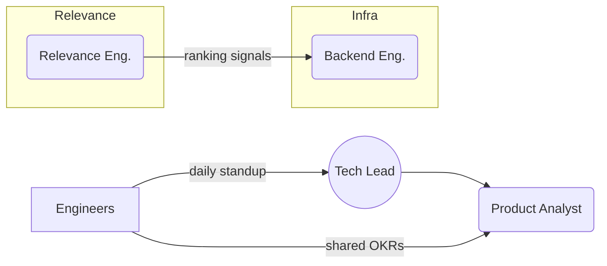

## Why a Dedicated Search Organisation?

- Search is the revenue lever you can A/B every day.
- The expertise required spans **IR, ML, Ops, and UX**—a blend no single “feature squad” will grow organically.
- A healthy search org separates *infrastructure debt* from *ranking innovation* so neither blocks the other.


---

## Phase 0 — Seed Team (↔ 0–5M queries /day)

| Role                        | Focus                                 | Typical Head‑Count |
| --------------------------- | ------------------------------------- | ------------------ |
| **Search Tech Lead**        | Vision, roadmap, hands‑on prototyping | 1                  |
| **Backend Engineer**        | Indexing pipeline, infra as code      | 1–2                |
| **Relevance Engineer**      | Ranking logic, offline experiments    | 1                  |
| **Product Analyst (½ FTE)** | KPI dashboards, query taxonomy        | 0.5                |

> 🗝️  *Bias to impact*: one tight pod shipping baseline relevance and performance monitoring.



---

## Phase 1 — Platform & Feature Streams (5–50M queries /day)

```
Search Guild
├─ Platform Squad     # owns infra & SLIs
│   ├─ TL (Staff SWE)
│   ├─ 3 Backend SWEs
│   └─ SRE
└─ Relevance Squad    # owns ranking & recall
    ├─ Applied Scientist
    ├─ 3 Relevance Eng.
    └─ Data Analyst
```

### Responsibilities Split

| Platform                                    | Relevance                  |
| ------------------------------------------- | -------------------------- |
| **Latency & Uptime**                        | **CTR / GMV uplift**       |
| Sharding, index size, zero‑downtime deploys | A/B tests, feature stores  |
| Observability stack                         | Offline evaluation harness |


> 💡 **Interface contract**: *Platform* exposes “/search” with recall sets; *Relevance* owns scoring plugins.

---

## Phase 2 — Domain‑Oriented Vertical Teams (>50M queries /day)

When search becomes a company‑wide product, split by **query intent verticals**:

- **Browse / Category Search** – taxonomy, facets, dynamic ranking.
- **Exact & SKU Search** – synonyms, product ID recall.
- **Discovery & Vector Search** – embeddings, multimodal signals.

```mermaid
graph TD
    Platform((Search Platform))
    subgraph Verticals
        CAT[Browse]\nSearch
        SKU[Exact]\nSearch
        VEC[Vector]\nSearch
    end
    Platform --> CAT
    Platform --> SKU
    Platform --> VEC
```

Each vertical owns its own **Relevance Pod** (ranking + analyst) while sharing Platform SRE & semantics libraries.

---

## Hiring Profile Cheat‑Sheet

| Competency          | Interview Signal               | Role            |
| ------------------- | ------------------------------ | --------------- |
| IR Theory           | BM25 vs TF‑IDF whiteboard      | Relevance Eng.  |
| Distributed Systems | Design a zero‑downtime reindex | Backend SWE     |
| Experimentation     | Reading a CTR uplift chart     | Product Analyst |
| Leadership          | Aligning KPIs across squads    | Search TL       |

---

## Governance & Rituals

1. **Weekly Relevance Review**\
   \> Each squad demos A/B metrics & error‑analysis snapshots.
2. **Monthly Platform SLO Retro**\
   \> Latency, index‑size trends, cost per query.
3. **Search Guild**\
   \> Lightning talks; shared RFCs across verticals.

---

## Exit Criteria for Each Phase

| Phase               | KPI Plateau            | Org Smell                          |
| ------------------- | ---------------------- | ---------------------------------- |
| Seed → Platform     | P95 latency >400 ms    | Infra tasks blocking ranking ideas |
| Platform → Vertical | >20 parallel A/B tests | Shared backlog becomes 50+ items   |

---

### Next Steps

- Flesh out **On‑call playbook** & rotation chart.
- Add cost vs latency quadrant diagram for infra trade‑offs.
- Insert real‑world case studies: *“Rolling out neural reranking at 100 M Q/day”.*

---